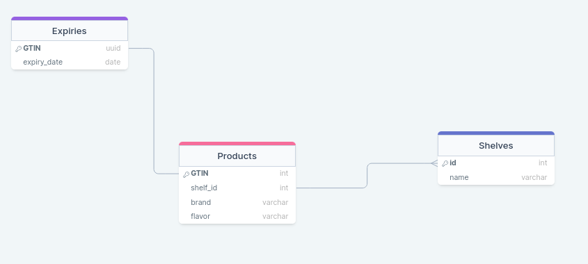

# Coda Bene Entry Test Backend
Author : Martin Chevereau

## Backend
The Django framework is imposed for the project\
It is composed of a single app called Inventory

### Views
- **Add product** Add an existing product to a shelf and specify its expiry date
- **Set expiry date** Update the expiry date for a product already in shelf
- **Display Expiries** Display product in shelves with their expiry dates
### DataBase
The choice of a relational database is imposed so I decided to add more information to justify this choice.

Each product has its own GTIN and belongs to a specific shelf (yogurts, cheeses...)\
Each table is represented through a Django **Model**\
The **PostgreSQL** DB runs online through railway

## Frontend
### Templates
## Areas of improvement
### Security 
Since I had to make the git repo public, anyone can access the database because of its infos present in the code...\
However these data are not crucial to protect\
I found out about tools like **Git secret** but this would have taken too much time to implement or I could have just give the DB info to the user but this is less practical